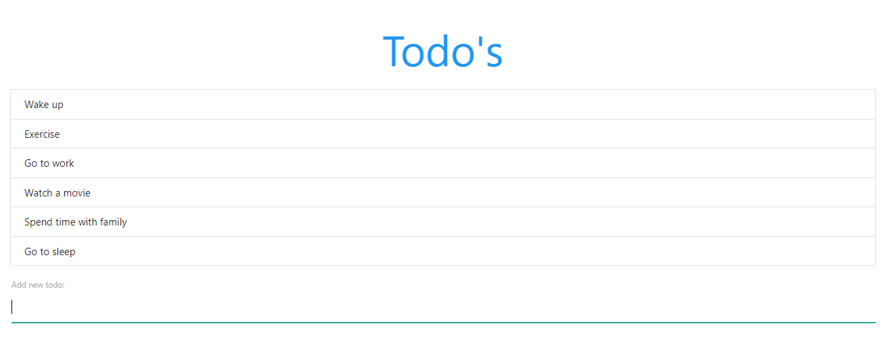

<h1 align="center">[React Toy Project] To-Do App</h1>

Toy Clone project using React, courtesy of *The Net Ninja*.
 

This is a simple To-Do list. 
- You can add a new task by typing and pressing enter. 
- You can delete a completed task by clicking on the task. 

간단한 할일(To-Do) 리스트 입니다. 
- 새로운 할일을 추가하려면 입력한 후 엔터를 누르세요. 
- 완료한 할일을 지우려면 리스트에서 할일을 클릭하세요. 

✔️ Created `2021-08-06` 
✔️ Using `React` 

## Install

To host the website on local server:
1. Clone the repository.
2. `npm i` ➔ `npm start`
